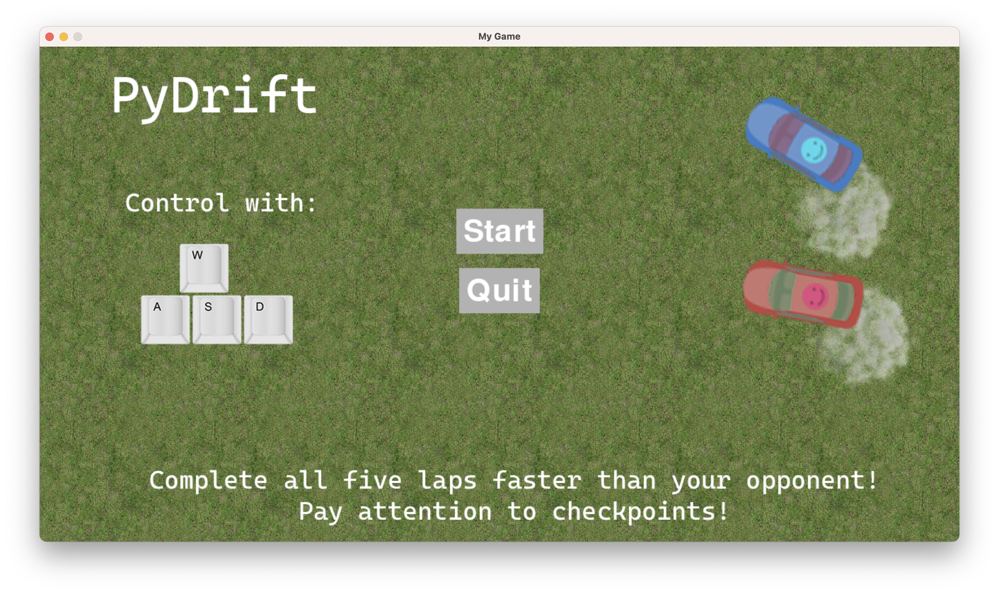
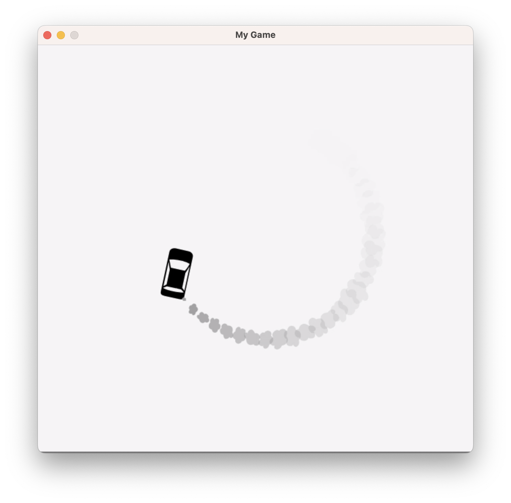
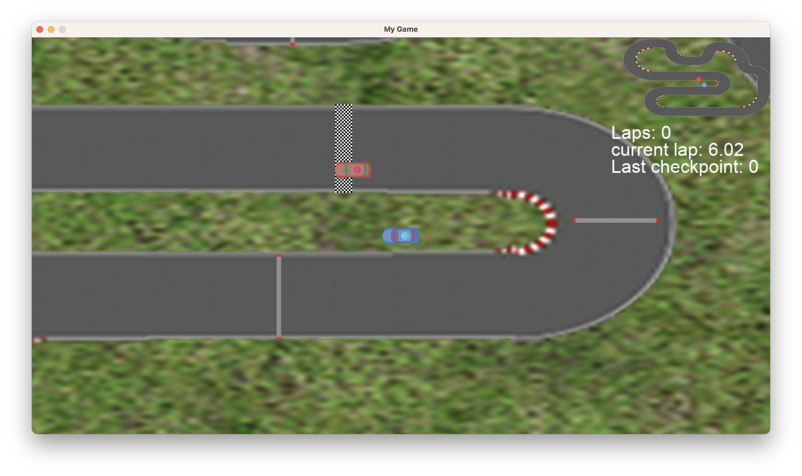

# PyDrift - the best multiplayer game written in pygame.

## Description

Pydrift is a fast-paced and exciting racing game built with pygame. With realistic physics and responsive controls,
pydrift offers a thrilling driving experience that is sure to keep players engaged. Customize your car competing for
high scores and testing your skills against the clock. With its immersive
gameplay, stunning graphics, and intuitive interface, pydrift is a must-play for fans of racing games and pygame
enthusiasts alike.

## Installation

1) Install requirements
   > pip install -r requirements.txt
2) Run server.py
   > python server.py
3) Run client.py on the first device
   > python client.py
4) Run client2.py on the second device
   > python client.py
5) Enjoy the game!

## Gameplay

Here's a screenshot of pydrift in action! The game features responsive controls and realistic physics, making for a fun
and challenging driving experience. You can customize your car and drift around tracks, competing for high
scores and racing against the clock.

